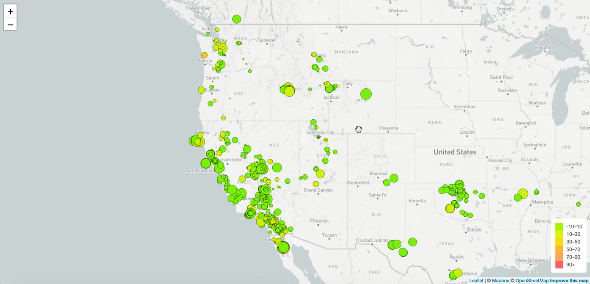
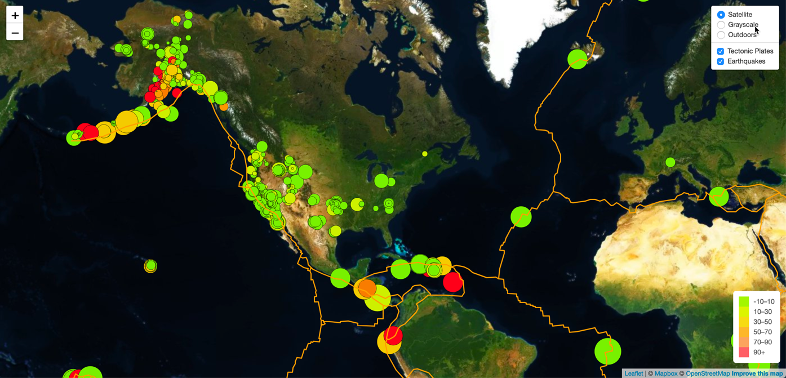

# leaflet-challenge
Module 15 Challenge to build a new set of tools that will allow USGS to visualize their earthquake data.

## Requirements
### Part 1: Earthquake Visualization

1. Get your dataset from [USGS GeoJSON Feed](http://earthquake.usgs.gov/earthquakes/feed/v1.0/geojson.php)
- Find dataset for past 7 days
2. Import and visualize the data using [Leaflet.js](https://leafletjs.com/)

### Part 2: Gather and Plot More Data

1. Plot the tectonic plates dataset on the map in addition to the earthquakes from this [source](https://github.com/fraxen/tectonicplates).
2. Add other base maps to choose from.
3. Put each dataset into separate overlays that can be turned on and off independently.
4. Add layer controls to your map.

## Resource Locations
1. [Images](https://github.com/rabellan/leaflet-challenge/tree/main/Images) - stock images from the starter zip files
2. [Leaflet-Part-1/js - logic1.js](https://github.com/rabellan/leaflet-challenge/tree/main/Leaflet-Part-1/js) - Javascript file of the minimum requirement of the challange
3. [Leaflet-Part-2/js - logic2.js](https://github.com/rabellan/leaflet-challenge/tree/main/Leaflet-Part-2/js) - Javascript file of bonus with the multiple overlays
4. [css](https://github.com/rabellan/leaflet-challenge/tree/main/css) - Cascading style sheet for the application
5. [index.html](https://github.com/rabellan/leaflet-challenge/blob/main/index.html) - main page of the application